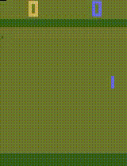
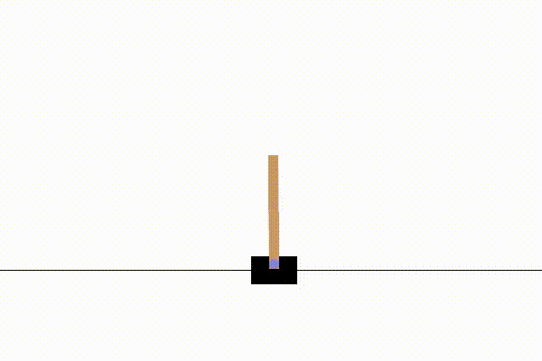

# gym_training
Reinforcement Learning on OpenAI Gym environment, with implementation of Deep Q-Network and Policy Gradient.


[Watch the video on YouTube](https://youtu.be/swFtTfiDwCU)
\
 \
Half-Cheetah-v4 (trained with Policy Gradient)

 \
_Pong-v4 (DQN)_ 

 \
_Cartpole-v1 (Policy Gradient)_ 


Run this command line for simulation using pretrained weights. \
\
**Policy Gradient**
```bash
python run_pg.py --config=<config_filename>
```
**DQN**
```bash
python run_dqn.py --config=<config_filename>
```

Use argument `--train` to train or `--record` to record video output.
Update `yaml` config file to change the parameters.

